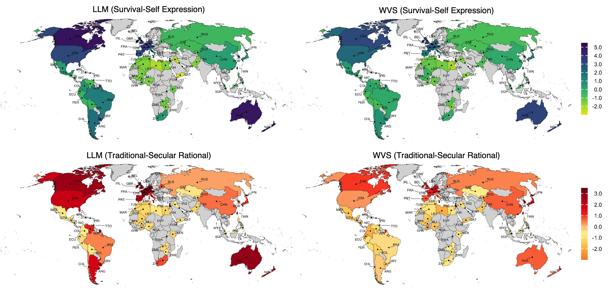

# The Value Atlas of AI

This repository accompanies the manuscript *The Value Atlas of AI: Mapping
World Human Values in Large Language Models*. In the paper, we study how 20
large language models represent cultural values across 66 countries and
territories by projecting model responses into the Inglehart-Welzel value
space and comparing them with human benchmark coordinates derived from the
Integrated Values Survey. The analyses reported in the manuscript identify a
strong secular-rational baseline bias, pronounced prompt-language effects, an
asymmetric English advantage in the representation of many non-Western
societies, and associations between these patterns and historical colonial
structures.

This repository now includes both the analysis code and the released processed data needed to reproduce the main paper results.


## Repository structure

```text
.
├── config/                     # Model registry, questionnaire definitions, country metadata
├── data/
│   ├── country_values/         # Human benchmark coordinates and PCA model
│   ├── external/               # Country-level regression covariates
│   ├── llm_interviews/         # Released processed interview tables
│   ├── llm_pca/                # Projected model/country coordinates
│   └── raw/                    # Optional raw IVS input if available
├── results/
│   ├── analysis/               # Main analysis outputs regenerated by the scripts
│   ├── figures/                # Rendered paper figures
│   └── paper_data/             # Paper derived tables
├── src/
│   ├── base/                   # Shared utilities for validation, recoding, PCA, and model calls
│   ├── country_values/         # Human benchmark construction
│   ├── figures/                # Figure-generation scripts
│   ├── llm_values/             # Intrinsic value analysis pipeline
│   ├── roleplay_multilingual/  # Multilingual roleplay analysis pipeline
│   └── run/                    # Entry-point scripts
└── Supplementary Materials/
    ├── data/                   # Supplementary source data
    └── figures/                # Supplementary rendered figures
```

## Quick start

### 1. Create an environment and install dependencies

```bash
pip install -r requirements.txt
```

### 2. Reproduce the main statistic analyses

```bash
python src/run/run_paper_analysis.py
```

This is the recommended entry point for most readers, reviewers, and users of the public release.

### 3. Regenerate figures if needed

Figure scripts are located in:

```text
src/figures/
```

They read from the processed data and paper outputs, then write figures to locations such as:

- `results/figures/paper/`
- `Supplementary Materials/figures/`

## Workflow Overview

The public release is organized around a processed-data-first workflow. The
diagram below shows how the data, the optional raw inputs,
and the main analysis scripts fit together.

```mermaid
flowchart TD
    A["data"] --> B["Processed benchmark files<br/>data/country_values/"]
    A --> C["Processed interview tables<br/>data/llm_interviews/"]
    A --> D["Projected coordinate tables<br/>data/llm_pca/"]
    A --> E["Publication-ready source data<br/>Supplementary Materials/data/"]

    F["Optional raw IVS file<br/>data/raw/*.sav"] --> G["run_country_values_analysis.py"]
    G --> B

    H["Optional private API reruns"] --> I["run_llm_values_analysis.py"]
    H --> J["run_llm_multilingual_analysis.py"]
    H --> K["run_roleplay_multilingual_analysis.py"]

    I --> C
    J --> C
    K --> C

    C --> L["Response validation and IVS recoding<br/>base_interview.py + ivs_question_processor.py"]
    L --> D
    B --> M["run_paper_analysis.py"]
    D --> M
    A --> N["Regression covariates<br/>data/external/regression_covariates.csv"]
    N --> M
    E --> O["Figure scripts<br/>src/figures/*.py"]
    M --> P["Paper outputs<br/>results/analysis/ + results/paper_data/"]
    P --> O
    O --> Q["Main-text and supplementary figures"]
 ```   

## Main inputs and outputs

The main statistic analysis depends on the following files:

```text
data/
  country_values/
    country_scores_pca.json
    pca_model_fixed.pkl
  external/
    regression_covariates.csv
  llm_pca/
    intrinsic/
      llm_pca_entity_scores.pkl
    multilingual/
      roleplay_ml_pca_entity_scores_latest.pkl

results/
  paper_data/
    regression_data.csv
```

### Main outputs

Running

```bash
python src/run/run_paper_analysis.py
```

produces paper-level outputs in:

- `results/analysis/`
- `results/paper_data/`

Key files include:

- `results/analysis/study1_intrinsic_bias.json`
- `results/analysis/study2_english_advantage.json`
- `results/analysis/study3_digital_orientalism.json`
- `results/analysis/study4_colonial_legacies.json`
- `results/analysis/model_imitation_accuracy.csv`
- `results/analysis/model_imitation_accuracy.json`
- `results/analysis/paper_statistics_all.json`
- `results/paper_data/regression_data.csv`

## Analytical workflow

## 1. Human benchmark construction

The human benchmark is generated from the IVS source data and defines the fixed coordinate space used throughout the project.

Entry point:

```bash
python src/run/run_country_values_analysis.py
```

Core files:

- `src/run/run_country_values_analysis.py`
- `src/country_values/data_processing.py`
- `src/country_values/pca_analysis.py`
- `src/base/base_pca_analyzer.py`

Required raw input:

- `data/country_values/Integrated_values_surveys_1981-2022.sav`
  or `data/raw/Integrated_values_surveys_1981-2022.sav`

Outputs:

- `data/country_values/country_scores_pca.json`
- `data/country_values/pca_model_fixed.pkl`


This input corresponds to the IVS benchmark derived from the EVS Trend File
1981-2017 (Version `3.0.0`; DOI `10.4232/1.14021`) and the WVS Trend File
1981-2022 (Version `4.1.0`; DOI `10.14281/18241.27`).

This stage defines the fixed coordinate space used throughout the rest of the
project.
## 2. Intrinsic model-value pipeline

The intrinsic pipeline queries each model in the six UN languages
and generates the language-comparison coordinates used in the baseline language
analysis.

Run:

```bash
python src/run/run_llm_multilingual_analysis.py --step all
```

Core files:

- `src/run/run_llm_multilingual_analysis.py`
- `src/llm_values/llm_multilingual_interview.py`
- `src/llm_values/llm_multilingual_data_processor.py`
- `src/base/base_interview.py`
- `src/base/ivs_question_processor.py`e

Useful commands:

```bash
python src/run/run_llm_multilingual_analysis.py --step 1 --consensus-count 5
python src/run/run_llm_multilingual_analysis.py --step 2
python src/run/run_llm_multilingual_analysis.py --step 3
```

Inputs:

- `config/questions/multilingual/multilingual_questions_complete.json`
- API keys in `.env` if private reruns are desired
- released processed tables in `data/llm_interviews/intrinsic/`

Outputs:

- `data/llm_interviews/intrinsic/multilingual_ivs_format.pkl`
- `data/llm_interviews/intrinsic/multilingual_ivs_format.json`
- `data/llm_pca/intrinsic/llm_pca_entity_scores.pkl`
- `data/llm_pca/intrinsic/llm_pca_entity_scores.json`

In this pipeline:

1. `llm_interview.py` sends the ten IVS/WVS items to each model.
2. `base_interview.py` loads API settings from `.env`, instantiates the model
   clients declared in `config/models/llm_models.json`, enforces numeric answer
   formatting, and retries malformed responses.
3. `llm_data_processor.py` converts the collected answers into IVS-compatible
   fields.
4. `ivs_question_processor.py` applies the shared recoding logic for `Y002` and
   `Y003`.
5. `llm_pca_analysis.py` projects processed model responses into the fixed
   benchmark space.

The original private workflow wrote raw response caches under
`data/llm_values/` or `data/llm_interviews/intrinsic/interview_raw/`. Those
full raw caches are not required for reproducing the published results. It produces processed interview tables and projected intrinsic coordinates used in the paper-level analysis.

## 3. Multilingual roleplay pipeline

This pipeline produces the country-language roleplay coordinates used in the
English-advantage, regional, and East Asia analyses.

Run:

```bash
python src/run/run_roleplay_multilingual_analysis.py
```

Core files:

- `src/run/run_roleplay_multilingual_analysis.py`
- `src/roleplay_multilingual/multilingual_roleplay_interview.py`
- `src/roleplay_multilingual/multilingual_roleplay_data_processor.py`
- `src/roleplay_multilingual/multilingual_roleplay_pca_analysis.py`
- `src/base/base_interview.py`
- `src/base/ivs_question_processor.py`

In this pipeline:

1. `multilingual_roleplay_interview.py` constructs country-language roleplay
   prompts for each model.
2. `base_interview.py` enforces numeric outputs and retry logic.
3. `multilingual_roleplay_data_processor.py` validates and recodes responses and
   standardizes country-language metadata.
4. `multilingual_roleplay_pca_analysis.py` projects the processed answers into
   the fixed benchmark space.

As with the intrinsic workflow, the full private `interview_raw/` caches are
not needed for public reproduction and are not included in the data.
The released archive instead provides the processed interview tables and the
projected coordinate files used in the paper.

## 4. Statistic analysis

The final integrative analysis combines:

- the fixed human benchmark,
- projected intrinsic model coordinates,
- projected multilingual roleplay coordinates, and
- country-level regression covariates.

Entry point:

```bash
python src/run/run_paper_analysis.py
```

This script generates the main study outputs used in the manuscript.

## 5. Figure generation

Figure scripts under `src/figures/` regenerate main-text and supplementary figures from the processed outputs.


| Figure | Script | Main released source data | Output location |
| --- | --- | --- | --- |
| Main Text Figure 1 | Released source data only; no standalone public renderer | `Supplementary Materials/data/figure1_data_66countries.csv` | Final manuscript assembly |
| Main Text Figure 2 | `python src/figures/generate_fig2_baseline.py` | `Supplementary Materials/data/figure2_baseline_20models.csv`, `Supplementary Materials/data/DataS1_ivs_pca_coordinates.csv` | `results/figures/paper/` |
| Main Text Figure 3 | Released source data only; no standalone public renderer | `Supplementary Materials/data/figure3_digital_orientalism.csv`, `Supplementary Materials/data/study3_digital_orientalism.json` | Final manuscript assembly |
| Main Text Figure 4 | Released source data only; no standalone public renderer | `Supplementary Materials/data/figure4_colonial_history.csv`, `Supplementary Materials/data/study4_colonial_legacies.json` | Final manuscript assembly |
| Supplementary Figure S1 | Released source data only; final figure assembled manually during manuscript preparation | `Supplementary Materials/data/DataS2_llm_baseline_pca.csv` | Final manuscript assembly |
| Supplementary Figure S2 | `python src/figures/generate_figS2_model_imitation.py` | `Supplementary Materials/data/model_imitation_accuracy.csv`, `Supplementary Materials/data/study5_model_imitation.json` | `Supplementary Materials/figures/FigS2/` |
| Supplementary Figure S3 | `python src/figures/generate_figS3_ivs_cultural_map.py` | `Supplementary Materials/data/DataS1_ivs_pca_coordinates.csv` or `Supplementary Materials/data/ivs_pca_coordinates.csv` | `Supplementary Materials/figures/FigS3/` |
| Supplementary Figure S4 | `python src/figures/generate_figS4_english_advantage.py` | `Supplementary Materials/data/figure3_digital_orientalism.csv`, `Supplementary Materials/data/study3_digital_orientalism.json` | `Supplementary Materials/figures/FigS4/` |
| Supplementary Figure S5 | `python src/figures/generate_figS5_east_asia.py` | `Supplementary Materials/data/llm_roleplay_pca.csv`, `Supplementary Materials/data/ivs_pca_coordinates.csv` | `Supplementary Materials/figures/FigS5/` |

All figure scripts read publication-ready source tables from
`Supplementary Materials/data/`.

## License

The code in this repository is released under the MIT License.

## Notes

- The public release is designed for reproducibility of the reported analyses,
  not for redistribution of raw commercial API-response caches.
- The raw IVS/WVS/EVS file is not included in this repository.