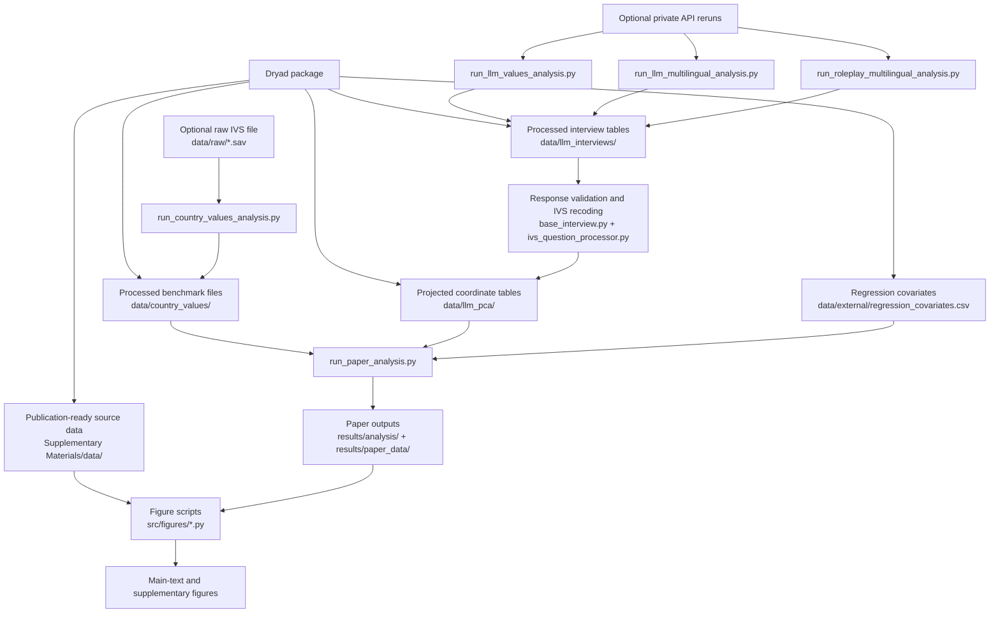

# The Value Atlas of AI

This repository accompanies the manuscript *The Value Atlas of AI: Mapping
World Human Values in Large Language Models*. In the paper, we study how 20
large language models represent cultural values across 66 countries and
territories by projecting model responses into the Inglehart-Welzel value
space and comparing them with human benchmark coordinates derived from the
Integrated Values Survey. The analyses reported in the manuscript identify a
strong secular-rational baseline bias, pronounced prompt-language effects, an
asymmetric English advantage in the representation of many non-Western
societies, and associations between these patterns and historical colonial
structures.

This repository provides the code used to reproduce those reported analyses.
It is designed to work together with the Dryad deposit for the paper, which
contains the released processed datasets, projected coordinates, and
publication-ready source tables. The public release is split deliberately:

- `GitHub`: code, configuration files, and reproducibility instructions
- `Dryad`: processed data, supplementary source tables, and figure source data

The directory layout follows the working project as closely as possible, so the
Dryad package can be copied into the repository root without rewriting file
paths.

## Paper Overview

At a high level, the project combines three pieces:

- a fixed human benchmark built from IVS/WVS cultural-value coordinates
- multilingual LLM response collection and recoding using ten WVS-derived items
- downstream distance-based analyses of language effects, regional asymmetries,
  and historical covariates

## Quick Start

For most readers and reviewers, the recommended path is to reproduce the paper
from the released processed data rather than rebuild the full pipeline from raw
survey files or private API-response caches.

1. Download the Dryad package for the paper.
2. Copy the Dryad contents into the root of this repository, preserving the
   relative paths.
3. Install dependencies:

```bash
pip install -r requirements.txt
```

4. Run the paper-level analysis:

```bash
python src/run/run_paper_analysis.py
```

This regenerates the paper-level outputs in:

- `results/analysis/`
- `results/paper_data/`

## Workflow Overview

The public release is organized around a processed-data-first workflow. The
diagram below shows how the released Dryad package, the optional raw inputs,
and the main analysis scripts fit together.



## What The Public Release Contains

This release is organized around the processed data used in the paper rather
than the full private data-collection workflow. The repository contains the
analysis code and configuration, while the Dryad package contains the released
processed interview tables, PCA coordinate files, regression inputs, and
publication-ready source data. The original IVS/WVS/EVS raw survey file is not
redistributed here.

The multilingual prompt templates and language-specific instructions are
preserved as released experimental materials in order to maintain fidelity to
the study design. Those strings are part of the core experimental stimuli, not
incidental comments.

## System Requirements

- Python `3.10` or later
- Standard scientific Python stack as listed in `requirements.txt`
- No GPU is required for the released processed-data reproduction path
- Private reruns of model calls require API credentials in `.env`

The released reproduction path is intended to run on a standard workstation or
laptop.

## Repository Layout

- `src/run/`
  Entry-point scripts for benchmark construction, intrinsic model analysis,
  multilingual intrinsic analysis, multilingual roleplay analysis, and final
  paper-level analysis.
- `src/base/`
  Shared utilities for model calls, response validation, recoding, and
  PCA-based projection.
- `src/country_values/`
  Human-benchmark construction from IVS data.
- `src/llm_values/`
  Intrinsic model interviewing, response processing, and coordinate
  computation.
- `src/roleplay_multilingual/`
  Multilingual country-roleplay interviewing, response processing, and
  coordinate computation.
- `src/figures/`
  Scripts used to regenerate the released main-text and supplementary figures.
- `config/`
  Model registry, questionnaire definitions, and country metadata.
- `data/`
  Expected location for released processed data and, optionally, the raw IVS
  `.sav` file.
- `results/`
  Output directories written by the analysis and figure scripts.
- `Supplementary Materials/data/`
  Publication-ready supplementary tables and figure source data from Dryad.

## Expected Dryad Layout

The released Dryad package is expected to mirror the current project
structure. The key locations are:

```text
data/
  country_values/
  external/
  llm_interviews/
    intrinsic/
    multilingual/
      processed/
  llm_pca/
    intrinsic/
    multilingual/
  raw/

results/
  paper_data/

Supplementary Materials/
  data/
```

The only path that may vary from the original working project is the raw IVS
survey file. The benchmark code accepts either:

- `data/country_values/Integrated_values_surveys_1981-2022.sav`
- `data/raw/Integrated_values_surveys_1981-2022.sav`

The raw IVS/WVS/EVS source file is not redistributed in this repository or in
the public Dryad package.

## Minimal Data Needed To Reproduce The Paper

To rerun the reported paper statistics from the released processed data, the
following files are sufficient:

```text
data/
  country_values/
    country_scores_pca.json
    pca_model_fixed.pkl
  external/
    regression_covariates.csv
  llm_pca/
    intrinsic/
      llm_pca_entity_scores.pkl
    multilingual/
      roleplay_ml_pca_entity_scores_latest.pkl

results/
  paper_data/
    regression_data.csv

Supplementary Materials/
  data/
    figure2_baseline_20models.csv
    model_imitation_accuracy.csv
    study5_model_imitation.json
    DataS1_ivs_pca_coordinates.csv
    ivs_pca_coordinates.csv
    llm_roleplay_pca.csv
    figure3_digital_orientalism.csv
    study3_digital_orientalism.json
    figure4_colonial_history.csv
```

`results/paper_data/regression_data.csv` is the released paper table used for
the manuscript source data. The separate file
`data/external/regression_covariates.csv` is an upstream lookup table that
supplies country-level covariates needed when regenerating the paper table from
the coordinate data.

## Reproduction Levels

### 1. Reproduce the paper results from released processed data

This is the recommended path for peer review.

Run:

```bash
python src/run/run_paper_analysis.py
```

Main inputs:

- `data/country_values/country_scores_pca.json`
- `data/country_values/pca_model_fixed.pkl`
- `data/llm_pca/intrinsic/llm_pca_entity_scores.pkl`
- `data/llm_pca/multilingual/roleplay_ml_pca_entity_scores_latest.pkl`
- `data/external/regression_covariates.csv`
- `results/paper_data/regression_data.csv`

Main outputs:

- `results/analysis/study1_intrinsic_bias.json`
- `results/analysis/study2_english_advantage.json`
- `results/analysis/study3_digital_orientalism.json`
- `results/analysis/study4_colonial_legacies.json`
- `results/analysis/model_imitation_accuracy.csv`
- `results/analysis/model_imitation_accuracy.json`
- `results/analysis/paper_statistics_all.json`
- `results/paper_data/`

### 2. Rebuild coordinate datasets from released processed interview tables

This level reconstructs the intrinsic and roleplay coordinate datasets from the
processed interview tables released in Dryad, without rerunning API calls.

Intrinsic interview tables:

- `data/llm_interviews/intrinsic/multilingual_ivs_format.pkl`
- `data/llm_interviews/intrinsic/multilingual_ivs_format.json`
- `data/llm_interviews/intrinsic/multilingual_processed_20260311_221147.pkl`
- `data/llm_interviews/intrinsic/multilingual_processed_20260311_221147.json`

Roleplay interview tables:

- `data/llm_interviews/multilingual/verified_data_for_report.json`
- `data/llm_interviews/multilingual/processed/llm_roleplay_ml_processed_responses_ivs_format_latest.pkl`
- `data/llm_interviews/multilingual/processed/multilingual_ivs_format.pkl`
- `data/llm_interviews/multilingual/processed/multilingual_ivs_format.json`
- `data/llm_interviews/multilingual/processed/roleplay_ml_language_analysis_latest.json`

### 3. Rebuild the human benchmark from raw IVS data

This level reconstructs the benchmark PCA model and country coordinates from
the original IVS `.sav` file. It is not required for reproducing the reported
paper results.

## Analytical Workflow

### Human benchmark

The human benchmark is built by:

```bash
python src/run/run_country_values_analysis.py
```

Core files:

- `src/run/run_country_values_analysis.py`
- `src/country_values/data_processing.py`
- `src/country_values/pca_analysis.py`
- `src/base/base_pca_analyzer.py`

Required raw input:

- `data/country_values/Integrated_values_surveys_1981-2022.sav`
  or `data/raw/Integrated_values_surveys_1981-2022.sav`

Outputs:

- `data/country_values/country_scores_pca.json`
- `data/country_values/pca_model_fixed.pkl`

This stage defines the fixed coordinate space used throughout the rest of the
project.

### Intrinsic model-value pipeline

The baseline intrinsic pipeline is controlled by:

```bash
python src/run/run_llm_values_analysis.py
```

Core files:

- `src/run/run_llm_values_analysis.py`
- `src/llm_values/llm_interview.py`
- `src/llm_values/llm_data_processor.py`
- `src/llm_values/llm_pca_analysis.py`
- `src/base/base_interview.py`
- `src/base/ivs_question_processor.py`

In this pipeline:

1. `llm_interview.py` sends the ten IVS/WVS items to each model.
2. `base_interview.py` loads API settings from `.env`, instantiates the model
   clients declared in `config/models/llm_models.json`, enforces numeric answer
   formatting, and retries malformed responses.
3. `llm_data_processor.py` converts the collected answers into IVS-compatible
   fields.
4. `ivs_question_processor.py` applies the shared recoding logic for `Y002` and
   `Y003`.
5. `llm_pca_analysis.py` projects processed model responses into the fixed
   benchmark space.

The original private workflow wrote raw response caches under
`data/llm_values/` or `data/llm_interviews/intrinsic/interview_raw/`. Those
full raw caches are not required for reproducing the published results and are
not part of the public Dryad package.

### Multilingual intrinsic pipeline

The multilingual intrinsic pipeline queries each model in the six UN languages
and generates the language-comparison coordinates used in the baseline language
analysis.

Run:

```bash
python src/run/run_llm_multilingual_analysis.py --step all
```

Core files:

- `src/run/run_llm_multilingual_analysis.py`
- `src/llm_values/llm_multilingual_interview.py`
- `src/llm_values/llm_multilingual_data_processor.py`
- `src/base/base_interview.py`
- `src/base/ivs_question_processor.py`

Useful commands:

```bash
python src/run/run_llm_multilingual_analysis.py --step 1 --consensus-count 5
python src/run/run_llm_multilingual_analysis.py --step 2
python src/run/run_llm_multilingual_analysis.py --step 3
```

Inputs:

- `config/questions/multilingual/multilingual_questions_complete.json`
- API keys in `.env` if private reruns are desired
- released processed tables in `data/llm_interviews/intrinsic/`

Outputs:

- `data/llm_interviews/intrinsic/multilingual_ivs_format.pkl`
- `data/llm_interviews/intrinsic/multilingual_ivs_format.json`
- `data/llm_pca/intrinsic/llm_pca_entity_scores.pkl`
- `data/llm_pca/intrinsic/llm_pca_entity_scores.json`

### Multilingual country-roleplay pipeline

This pipeline produces the country-language roleplay coordinates used in the
English-advantage, regional, and East Asia analyses.

Run:

```bash
python src/run/run_roleplay_multilingual_analysis.py
```

Core files:

- `src/run/run_roleplay_multilingual_analysis.py`
- `src/roleplay_multilingual/multilingual_roleplay_interview.py`
- `src/roleplay_multilingual/multilingual_roleplay_data_processor.py`
- `src/roleplay_multilingual/multilingual_roleplay_pca_analysis.py`
- `src/base/base_interview.py`
- `src/base/ivs_question_processor.py`

In this pipeline:

1. `multilingual_roleplay_interview.py` constructs country-language roleplay
   prompts for each model.
2. `base_interview.py` enforces numeric outputs and retry logic.
3. `multilingual_roleplay_data_processor.py` validates and recodes responses and
   standardizes country-language metadata.
4. `multilingual_roleplay_pca_analysis.py` projects the processed answers into
   the fixed benchmark space.

As with the intrinsic workflow, the full private `interview_raw/` caches are
not needed for public reproduction and are not included in the Dryad package.
The released archive instead provides the processed interview tables and the
projected coordinate files used in the paper.

## Shared Validation And Recoding

Two modules define the common response-processing logic used across the
repository.

### `src/base/base_interview.py`

This module handles:

- API key loading from `.env`
- model-client creation from `config/models/llm_models.json`
- language-specific numeric format hints
- retry logic for malformed or incomplete answers
- raw-answer collection during private data collection

### `src/base/ivs_question_processor.py`

This module handles:

- extracting numeric values from answer text
- validating the expected format for each IVS item
- recoding `Y002` into the materialist/postmaterialist index
- recoding `Y003` into the binary child-quality indicators and the derived
  traditional-versus-secular-rational score

These rules are shared across the intrinsic and roleplay pipelines so that all
released tables enter the downstream analyses in a common format.

## Figure Reproduction

This repository includes direct rendering scripts for Main Text Figure 2 and
Supplementary Figures S2-S5. Supplementary Figure S1 is not regenerated by a
standalone script in this cleaned public repository.

| Figure | Script | Main released source data | Output location |
| --- | --- | --- | --- |
| Main Text Figure 2 | `python src/figures/generate_fig2_baseline.py` | `Supplementary Materials/data/figure2_baseline_20models.csv`, `Supplementary Materials/data/DataS1_ivs_pca_coordinates.csv` | `results/figures/paper/` |
| Supplementary Figure S2 | `python src/figures/generate_figS2_model_imitation.py` | `Supplementary Materials/data/model_imitation_accuracy.csv`, `Supplementary Materials/data/study5_model_imitation.json` | `Supplementary Materials/figures/FigS2/` |
| Supplementary Figure S3 | `python src/figures/generate_figS3_ivs_cultural_map.py` | `Supplementary Materials/data/DataS1_ivs_pca_coordinates.csv` or `Supplementary Materials/data/ivs_pca_coordinates.csv` | `Supplementary Materials/figures/FigS3/` |
| Supplementary Figure S4 | `python src/figures/generate_figS4_english_advantage.py` | `Supplementary Materials/data/figure3_digital_orientalism.csv`, `Supplementary Materials/data/study3_digital_orientalism.json` | `Supplementary Materials/figures/FigS4/` |
| Supplementary Figure S5 | `python src/figures/generate_figS5_east_asia.py` | `Supplementary Materials/data/llm_roleplay_pca.csv`, `Supplementary Materials/data/ivs_pca_coordinates.csv` | `Supplementary Materials/figures/FigS5/` |

All figure scripts read publication-ready source tables from
`Supplementary Materials/data/`.

## Environment Setup

Install the Python dependencies with:

```bash
pip install -r requirements.txt
```

If you want to rerun private API calls rather than use the released processed
tables, create a `.env` file in the repository root and provide the keys
referenced in `config/models/llm_models.json`.

## License

The final public release should include explicit code and data licenses in the
GitHub and Dryad records. In the current submission-stage repository, please
interpret this codebase as the research software accompanying the manuscript
and the released processed-data archive.

## Citation

If you use this repository or the associated released data, please cite the
paper and the archival data/code records associated with the public release.
A compact citation entry can be added here once the final manuscript citation
and repository DOIs are available.

## Notes

- The public release is designed for reproducibility of the reported analyses,
  not for redistribution of raw commercial API-response caches.
- The raw IVS/WVS/EVS file is not included in this repository.
- In normal use, this repository should be paired with the Dryad data package
  rather than treated as a standalone data archive.
